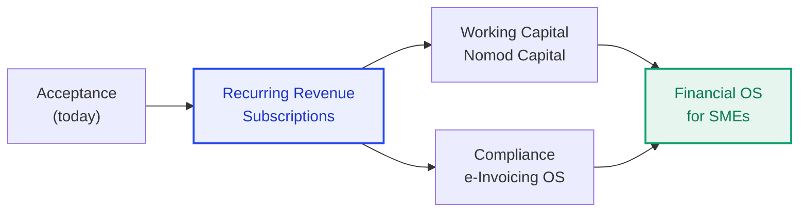
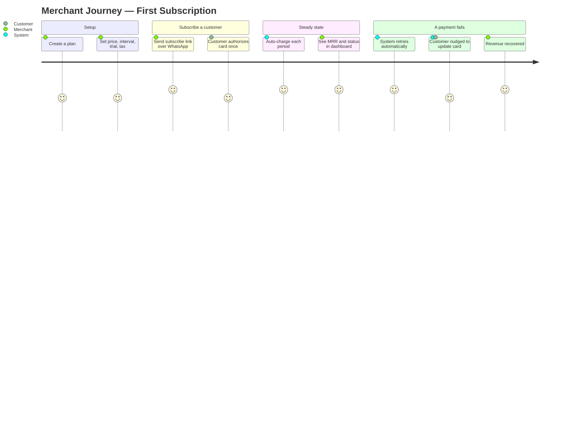
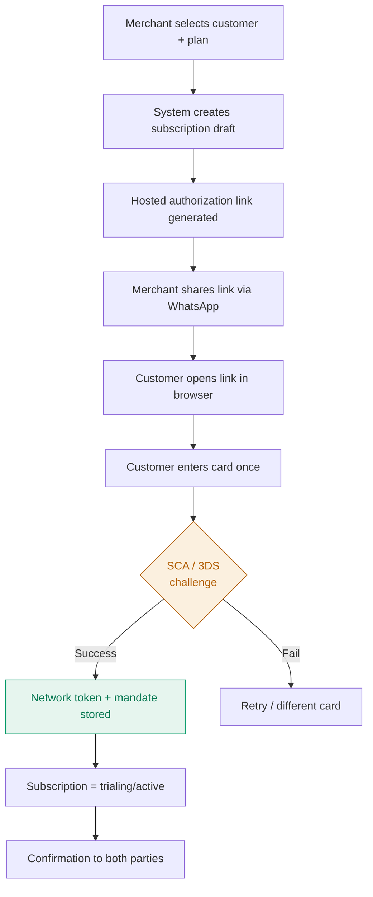
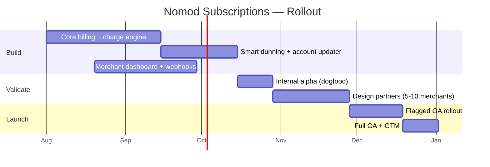

<div align="center">

# 🔁 Nomod Subscriptions
### Product Requirements Document — Recurring Billing with Smart Dunning


**Turn Nomod from a way to _take_ a payment into infrastructure that _retains_ revenue.**

</div>

---

| Field | Value |
|---|---|
| **Document** | PRD — Nomod Subscriptions |
| **Version** | 1.0 (Draft for review) |
| **Author** | Mohamed Shall |
| **Status** | 🟡 In Review |
| **Reviewers** | VP Engineering · Head of Product · Head of Risk · Finance/Treasury |
| **Related** | `RFC-Nomod-Subscriptions.md` (technical design) |
| **Last updated** | 2026-07-27 |

> [!NOTE]
> This PRD defines **what** we are building and **why**. The companion RFC defines **how**. All quantitative targets in this document are illustrative starting points to be validated with design partners before GA.

---

## 📑 Table of Contents

1. [TL;DR](#-tldr)
2. [Problem & Context](#-1-problem--context)
3. [Why Now](#-2-why-now)
4. [Goals, Non-Goals & Success Metrics](#-3-goals-non-goals--success-metrics)
5. [Users & Personas](#-4-users--personas)
6. [Jobs-To-Be-Done & User Journeys](#-5-jobs-to-be-done--user-journeys)
7. [Product Requirements](#-6-product-requirements)
8. [User Stories & Acceptance Criteria](#-7-user-stories--acceptance-criteria)
9. [Scope & Phasing](#-8-scope--phasing)
10. [Experience & Flows](#-9-experience--flows)
11. [Business Rules & Policies](#-10-business-rules--policies)
12. [Metrics, Analytics & Instrumentation](#-11-metrics-analytics--instrumentation)
13. [Compliance & Regulatory](#-12-compliance--regulatory)
14. [Dependencies & Assumptions](#-13-dependencies--assumptions)
15. [Risks & Mitigations](#-14-risks--mitigations)
16. [Rollout & Go-To-Market](#-15-rollout--go-to-market)
17. [Open Questions](#-16-open-questions)
18. [Appendix](#-17-appendix)

---

## 🎯 TL;DR

Nomod's merchant base is full of recurring-revenue businesses — gyms, tutors, clinics, salons, memberships, small SaaS, and tourism packages — yet today they **re-send a payment link by hand every billing cycle**. That leaks revenue, burns admin time, and pushes Nomod's highest-value merchants toward Stripe.

**Nomod Subscriptions** lets any merchant define a plan, subscribe a customer once with a saved (tokenized) card, and bill automatically on a schedule. Critically, it ships with **Smart Dunning** — an automated recovery engine that fights _involuntary churn_ (failed cards, expiries, insufficient funds), which is the single largest silent leak of recurring revenue.

| | |
|---|---|
| 🧩 **What** | Recurring billing (plans, subscriptions, automated invoicing & charges) + smart dunning/recovery |
| 👥 **For** | Nomod merchants with recurring revenue, and their customers |
| 📈 **North Star** | **Recurring TPV as a % of total TPV** — proof the platform got stickier |
| 🏆 **Why it wins** | Closes Nomod's biggest competitive gap vs. Stripe; converts one-off acceptance into retained lifetime value; opens the door to Capital & Compliance products |
| 🚫 **Out of scope (v1)** | Usage-based metering, complex proration, multi-seat tiering, BNPL-on-recurring |

---

## 🔍 1. Problem & Context

### 1.1 The problem

Recurring-revenue SMEs are a large and high-value slice of Nomod's ~40,000 merchants. Today, to collect a monthly membership or retainer, a merchant must:

1. Manually create a new payment link or invoice every cycle.
2. Chase the customer to pay it (usually over WhatsApp).
3. Reconcile who paid, who didn't, and who churned — by hand.

This creates three compounding failures:

| Failure | Consequence | Who feels it |
|---|---|---|
| **Manual re-billing** | Missed cycles, revenue leakage, hours of admin per month | Merchant |
| **Involuntary churn** | Expired/declined cards silently kill MRR; nobody notices until the report | Merchant (revenue) |
| **No system of record** | Merchant can't see MRR, active vs. paused vs. churned, or recovery | Merchant + Nomod |

> [!IMPORTANT]
> **Involuntary churn is the hidden killer.** In subscription businesses, a large share of cancellations are not customers _choosing_ to leave — they're payment failures. Industry benchmarks put involuntary churn at a meaningful fraction of total churn. Any recurring product that doesn't ship recovery is shipping a leaky bucket.

### 1.2 Competitive context

| Player | Recurring capability | Implication for Nomod |
|---|---|---|
| **Stripe / Checkout.com** | Deep, mature billing + dunning + revenue recovery | Sets the bar; wins Nomod's larger/technical merchants today |
| **Ziina** | Fast-moving on accounts, cards, financial services | Racing Nomod for the same SME; recurring is a land grab |
| **Telr / PayTabs** | Gateway-centric; limited native subscriptions | Beatable if Nomod ships a mobile-first, WhatsApp-native experience |
| **Nomod (today)** | ❌ No native recurring | The gap this PRD closes |

### 1.3 Strategic fit

Nomod's mission is to become the **financial operating system for SMEs in emerging markets** — expanding from hardware-free acceptance into accounts, cards, and lending. Subscriptions is the keystone:



Recurring billing generates the **predictable revenue data** that later underwrites Nomod Capital and feeds the compliance/reconciliation products. It is the highest-leverage next step.

---

## ⏰ 2. Why Now

- ✅ **The building blocks already exist.** Nomod already has first-class `Customers`, `Invoices`, `Charges`, and a tokenized card-on-file capability via its REST API — Subscriptions is an orchestration layer on top, not a green-field rebuild.
- ✅ **The gap is actively costing merchants.** Every recurring merchant is a daily manual-billing tax and a churn risk.
- ✅ **Competitive pressure is real and accelerating** (Ziina's financial-services push; global gateways owning billing).
- ✅ **It unlocks the roadmap** (Capital, Compliance) rather than being a dead-end feature.

---

## 🎯 3. Goals, Non-Goals & Success Metrics

### 3.1 Goals

- **G1** — Let any merchant bill a customer automatically on a recurring schedule with zero manual effort per cycle.
- **G2** — Recover the maximum share of failed recurring payments automatically (smart dunning).
- **G3** — Give merchants a clear system of record for recurring revenue (MRR, active/paused/churned, failed, recovered).
- **G4** — Do all of this **without ever compromising money correctness** or PCI/regulatory posture.

### 3.2 Non-Goals (explicitly out for v1)

- ❌ Usage-based / metered billing (per-API-call, per-unit).
- ❌ Complex proration on mid-cycle plan changes (v1 uses simple, predictable rules).
- ❌ Multi-seat / quantity-tiered pricing.
- ❌ BNPL (Tabby/Tamara) on recurring — these are single-purchase instruments by design.
- ❌ Marketplace/split-payment recurring.

> [!TIP]
> Naming non-goals is a feature, not an omission. It protects the MVP line and makes the trade-off a **decision** the whole team can see.

### 3.3 Success metrics

| Tier | Metric | Definition | Target (illustrative) |
|---|---|---|---|
| ⭐ **North Star** | Recurring TPV share | Recurring TPV ÷ total TPV | Grows quarter over quarter |
| 📈 Adoption | Merchant activation | % eligible merchants with ≥1 active plan within 90 days of GA | ≥ 15% |
| 📈 Adoption | Subscriptions created | Active subscriptions on platform | Growth trend |
| 💰 Recovery | Dunning recovery rate | Failed charges recovered ÷ total failed | ≥ 55% |
| 💰 Recovery | Involuntary churn rate | Subs lost to payment failure ÷ active subs | ↓ trending down |
| 🛡️ Guardrail | Dispute/chargeback rate | Disputes ÷ recurring charges | ≤ card-scheme thresholds |
| 🛡️ Guardrail | Double-charge incidents | Duplicate charges per period | **0 (hard requirement)** |
| 🛡️ Guardrail | 3DS drop-off | Abandonment on initial mandate step | Monitored; minimized |
| 😀 Satisfaction | Merchant CSAT on billing | Survey / support ticket rate | ↑ |

---

## 👥 4. Users & Personas

<table>
<tr>
<td width="33%" valign="top">

### 🧑‍💼 Merchant Admin
**"Layla" — boutique gym owner**

- Runs a 3-staff studio in Dubai
- Bills ~120 monthly members
- Lives in the Nomod app + WhatsApp
- **Pain:** re-sending links every month; doesn't know who lapsed until money's short
- **Wants:** set it once, get paid, see MRR

</td>
<td width="33%" valign="top">

### 🧑 End Customer
**"Omar" — the member**

- Pays AED 149/month
- Opens links in a browser, no Nomod account
- **Pain:** hates re-entering card details; annoyed by awkward payment chases
- **Wants:** pay once, forget it; easy way to update card

</td>
<td width="33%" valign="top">

### 🛡️ Nomod Ops / Risk
**Internal operator**

- Monitors dispute & decline rates
- Owns the merchant-risk envelope
- **Pain:** aggressive dunning can spike chargebacks
- **Wants:** guardrails, auditability, controls on retry behavior

</td>
</tr>
</table>

---

## 🧭 5. Jobs-To-Be-Done & User Journeys

**JTBD (Merchant):** _"When a customer commits to a recurring service, I want to get paid every period automatically and know instantly if a payment fails, so I keep my revenue without chasing anyone."_

**JTBD (Customer):** _"When I sign up for a recurring service, I want to authorize payment once and update my card painlessly, so I never lose access over a billing hiccup."_

### 5.1 Merchant journey



---

## 📋 6. Product Requirements

### 6.1 Functional requirements (MoSCoW)

| ID | Requirement | Priority |
|---|---|---|
| FR-1 | Merchant can create/edit/archive a **Plan** (amount, currency, interval, trial days, tax behavior) | 🔴 Must |
| FR-2 | Merchant can **subscribe** an existing Customer to a Plan with a saved payment method | 🔴 Must |
| FR-3 | Customer can authorize a recurring **mandate** once (CIT + SCA/3DS) via a hosted page | 🔴 Must |
| FR-4 | System **auto-generates an invoice** and **charges** the card each period, exactly once | 🔴 Must |
| FR-5 | **Smart dunning**: configurable retry schedule on failure | 🔴 Must |
| FR-6 | **Network account updater**: auto-refresh expired/updated card tokens before retry | 🔴 Must |
| FR-7 | **Hosted "update card" page** pushed to customer via WhatsApp/email on failure | 🔴 Must |
| FR-8 | Merchant **dashboard**: MRR, active/paused/past-due/canceled, failed, recovered | 🔴 Must |
| FR-9 | Lifecycle controls: **pause, resume, cancel, change plan** | 🟠 Should |
| FR-10 | **Webhooks/events** for all subscription & invoice state changes | 🔴 Must |
| FR-11 | **Trials** (free period before first charge) | 🟠 Should |
| FR-12 | **Tax handling** (inclusive/exclusive VAT) on invoices, FTA-compliant fields | 🟠 Should |
| FR-13 | **Multi-currency** plans; settle to AED/SAR | 🟠 Should |
| FR-14 | **API-first**: everything above available via REST for developer merchants | 🟠 Should |
| FR-15 | Merchant-configurable **dunning policy** (retry curve, tone, stop rules) | 🟡 Could |
| FR-16 | **Proration** on mid-cycle upgrades (simple, predictable) | 🟡 Could |
| FR-17 | Subscriber-facing **customer portal** (self-serve manage/cancel) | 🟡 Could |

### 6.2 Non-functional requirements

| ID | Category | Requirement |
|---|---|---|
| NFR-1 | **Correctness** | No double-charge, no missed charge. Money correctness > latency. |
| NFR-2 | **Idempotency** | Every money-moving operation is idempotent and safely retryable. |
| NFR-3 | **Security / PCI** | PANs never stored in Nomod services; network tokens only; PCI scope minimized. |
| NFR-4 | **Compliance** | Valid stored-credential mandate; SCA on CIT; MIT flags on renewals; auditable consent. |
| NFR-5 | **Reliability** | Billing runs must survive service restarts; at-least-once with dedupe. |
| NFR-6 | **Scalability** | Handle month-start billing spikes without degradation (schedule smoothing). |
| NFR-7 | **Observability** | Every payment traceable end-to-end; decline & reconciliation alerting. |
| NFR-8 | **Auditability** | Immutable, regulator-ready trail for every subscription, invoice, charge, mandate. |
| NFR-9 | **Performance** | Dashboard reads < 500 ms p95; charge enqueue latency non-blocking. |

---

## ✅ 7. User Stories & Acceptance Criteria

<details>
<summary><b>US-1 — Create a plan</b></summary>

> **As** a merchant, **I want** to define a recurring plan, **so that** I can subscribe customers to it.

**Acceptance criteria (Gherkin):**
```gherkin
Scenario: Merchant creates a monthly plan
  Given I am an authenticated merchant
  When I create a plan with amount 149.00 AED, interval "month", trial 7 days
  Then the plan is saved and returns a plan_id
  And the plan is available to subscribe customers to
```
</details>

<details>
<summary><b>US-2 — Subscribe a customer with a one-time authorization</b></summary>

> **As** a merchant, **I want** to subscribe a customer who authorizes their card once, **so that** I never have to collect payment manually again.

**Acceptance criteria:**
```gherkin
Scenario: Customer authorizes recurring mandate
  Given a plan exists and a customer record exists
  When I create a subscription and the customer completes SCA/3DS on the hosted page
  Then a network token and stored-credential mandate are saved
  And the subscription status becomes "trialing" or "active"
  And no card PAN is stored in any Nomod service
```
</details>

<details>
<summary><b>US-3 — Automatic recurring charge (exactly once)</b></summary>

> **As** a merchant, **I want** each period billed automatically, **so that** revenue arrives without effort.

**Acceptance criteria:**
```gherkin
Scenario: Period renewal charges exactly once
  Given an active subscription due for renewal today
  When the billing engine processes the due period
  Then exactly one invoice is generated for that period
  And exactly one charge is attempted, even if the billing job retries
  And a successful charge posts a double-entry ledger entry
```
</details>

<details>
<summary><b>US-4 — Failed payment triggers smart dunning</b></summary>

> **As** a merchant, **I want** failed payments retried and the customer nudged, **so that** I recover revenue automatically.

**Acceptance criteria:**
```gherkin
Scenario: Soft decline recovery
  Given a recurring charge fails with a soft decline (insufficient funds)
  When the dunning engine runs
  Then the subscription moves to "past_due"
  And retries follow the configured curve (e.g., day 1, 3, 5, 7)
  And the account updater refreshes the token before retrying
  And the customer receives an "update card" link via WhatsApp/email
  And on success the subscription returns to "active"
  And when retries are exhausted the subscription moves to "unpaid"
```
</details>

---

## 🗺️ 8. Scope & Phasing

| Capability | 🟢 MVP (v1) | 🔵 v1.1 | 🟣 v2 |
|---|:---:|:---:|:---:|
| Plans (amount, interval, trial, tax) | ✅ | | |
| Subscribe with tokenized card + 3DS mandate | ✅ | | |
| Automated invoicing + exactly-once charge | ✅ | | |
| Smart dunning (retry curve + account updater) | ✅ | | |
| Hosted "update card" page + WhatsApp/email nudge | ✅ | | |
| Merchant MRR dashboard | ✅ | | |
| Webhooks/events | ✅ | | |
| Pause / resume / cancel / change plan | ✅ | | |
| Multi-currency plans | | ✅ | |
| Merchant-configurable dunning policy | | ✅ | |
| Customer self-serve portal | | ✅ | |
| Simple proration on upgrades | | | ✅ |
| Usage-based / metered billing | | | ✅ |
| Multi-seat / quantity tiers | | | ✅ |

---

## 🎨 9. Experience & Flows

### 9.1 Subscribe flow (merchant → customer)



### 9.2 Key states the UI must express

| State | Merchant sees | Customer experience |
|---|---|---|
| `trialing` | "Trial ends in N days" | Free access, no charge yet |
| `active` | "Next charge on DD MMM" | Charged automatically |
| `past_due` | ⚠️ "Payment failed — recovering" | Nudge to update card |
| `paused` | "Paused by you" | No charges |
| `canceled` | "Canceled" | Access ends per policy |
| `unpaid` | ❌ "Recovery exhausted" | Access suspended |

---

## 📕 10. Business Rules & Policies

| Rule | Policy (v1) |
|---|---|
| **Billing anchor** | Charge on the subscription's period-start date; align to a consistent anchor day. |
| **Trials** | No charge during trial; first charge at trial end. Card authorized up front. |
| **Retry curve** | Default: attempts on day 1, 3, 5, 7 after failure (with jitter). Configurable in v1.1. |
| **Account updater** | Run before each retry to refresh expired tokens. |
| **Soft vs hard decline** | Soft (insufficient funds/temporary) → retry. Hard (stolen/lost) → stop, notify, no retry. |
| **Grace / access** | Access continues through `past_due` until `unpaid` (merchant-configurable later). |
| **Cancellation** | Cancel at period end by default; immediate cancel optional. No auto-refunds in v1. |
| **Tax** | Inclusive/exclusive VAT per plan; FTA-compliant invoice fields. |
| **Currency** | v1 single currency per plan; settle to AED/SAR. |
| **BNPL** | Not supported on recurring (Tabby/Tamara are single-purchase). |
| **Dunning comms** | Merchant-approved templates; opt-out honored; capped frequency. |

---

## 📊 11. Metrics, Analytics & Instrumentation

### 11.1 Event taxonomy (emit for analytics + webhooks)

```
plan.created                 subscription.paused
subscription.created         subscription.resumed
subscription.activated       invoice.created
subscription.trial_started   invoice.paid
subscription.past_due        invoice.payment_failed
subscription.recovered       dunning.attempt_made
subscription.canceled        dunning.exhausted
subscription.unpaid          card.updated
```

### 11.2 Dashboards

- **Merchant dashboard:** MRR, active count, new vs. churned, failed & recovered, upcoming renewals.
- **Nomod internal:** cohort retention, dunning recovery rate, involuntary churn, dispute rate, decline-code distribution.

> [!WARNING]
> **Guardrail alerting is mandatory.** Alert on dispute-rate approaching scheme thresholds and on any reconciliation drift — these are the leading indicators that dunning is too aggressive or billing has a correctness bug.

---

## ⚖️ 12. Compliance & Regulatory

| Area | Requirement |
|---|---|
| **CBUAE** | Operate within the UAE retail payment framework; consumer-protection expectations on recurring (clear consent, easy cancellation, notice). |
| **PCI-DSS** | No PANs in Nomod services; tokenization confines scope to a small enclave. |
| **SCA / 3DS** | Strong authentication on the initial customer-initiated transaction (CIT) to establish the mandate. |
| **Stored-credential mandate** | Every renewal is merchant-initiated (MIT) with the correct stored-credential indicator per scheme rules. |
| **Consent & audit** | Immutable record of when/how the customer authorized recurring billing. |
| **Tax / FTA** | Invoices carry FTA-compliant VAT treatment; ready to extend to KSA ZATCA. |
| **AML** | Recurring flows inherit existing merchant KYB/monitoring; no new gaps. |

> [!IMPORTANT]
> Surface the compliance implications **before** they're asked. A recurring product without a valid mandate model is not shippable — it's a scheme-rule and consumer-protection violation waiting to happen.

---

## 🔗 13. Dependencies & Assumptions

**Dependencies**
- Existing `Customers`, `Invoices`, `Charges` services and REST API.
- Tokenization vault + 3DS server (in place or via processor).
- Notification service with WhatsApp Business API + email.
- Ledger/settlement services.
- Processor support for MIT/stored-credential and network account updater.

**Assumptions**
- A meaningful share of merchants have recurring-revenue use cases.
- Processor supports network tokens and account updater in Nomod's markets.
- WhatsApp remains the primary merchant↔customer channel.

---

## ⚠️ 14. Risks & Mitigations

| # | Risk | Likelihood | Impact | Mitigation |
|---|---|:---:|:---:|---|
| R1 | Double-charge from billing retries | Low | 🔴 Critical | Deterministic idempotency keys + server dedupe + advisory locks (see RFC) |
| R2 | Aggressive dunning spikes chargebacks | Med | 🟠 High | Decline-code branching, capped retries, guardrail alerting, ops controls |
| R3 | 3DS friction on first charge hurts conversion | Med | 🟠 High | Clean hosted UX; only where mandate requires; clear value framing |
| R4 | Processor lacks account updater in a market | Med | 🟠 Med | Fallback to hosted update-card nudge; degrade gracefully |
| R5 | Month-start billing spike overloads system | Med | 🟠 Med | Shard/smear schedules across the day; backpressure (see RFC) |
| R6 | Tax/mandate rules differ UAE vs KSA | Med | 🟠 Med | Jurisdiction-abstracted tax + mandate config |
| R7 | Merchants confused by states (past_due, unpaid) | Med | 🟡 Low | Clear UI copy; proactive notifications |

---

## 🚀 15. Rollout & Go-To-Market



**Phases**
1. **Alpha (internal):** dogfood on test merchants; validate correctness & recovery.
2. **Design partners:** 5–10 real recurring merchants (a gym, a clinic, a tutor); measure activation, recovery, disputes.
3. **Flagged GA:** feature flag by merchant segment; guardrail metrics gate expansion.
4. **Full GA + GTM:** in-app promotion, WhatsApp announcement, help content, sales enablement.

**Guardrail gates between phases:** zero double-charges, dispute rate within thresholds, recovery rate ≥ target.

---

## ❓ 16. Open Questions

- [ ] Default grace-period behavior on `past_due` — how long before access is suspended?
- [ ] Do we expose a customer self-serve portal in v1.1 or defer to v2?
- [ ] Which processor capabilities (account updater, network tokens) are confirmed per market (UAE vs KSA)?
- [ ] Pricing: is recurring priced at standard MDR, or is dunning-recovery a premium (Membership) feature?
- [ ] Refund policy on mid-cycle cancellation — none, prorated, or merchant-configurable?

---

## 📎 17. Appendix

### 17.1 Glossary

| Term | Meaning |
|---|---|
| **CIT** | Customer-Initiated Transaction — the customer actively authorizes (first charge). |
| **MIT** | Merchant-Initiated Transaction — merchant charges a stored credential (renewals). |
| **SCA / 3DS** | Strong Customer Authentication via 3-D Secure. |
| **Network token** | Scheme-issued token replacing the PAN; reduces PCI scope. |
| **Account Updater** | Scheme service that refreshes updated/expired card credentials. |
| **Dunning** | Automated retry + communication process to recover failed payments. |
| **Involuntary churn** | Subscription lost to payment failure, not customer choice. |
| **MRR** | Monthly Recurring Revenue. |
| **TPV** | Total Payment Volume. |

### 17.2 References

- Companion technical design: `RFC-Nomod-Subscriptions.md`
- Nomod API resources: Links, Invoices, Charges, Hosted Checkout, Customers, Team, Lookup Data
- Nomod payment methods: Visa, Mastercard, Amex, Mada, Apple Pay, Google Pay, Tabby, Tamara

---

<div align="center">

**PRD — Nomod Subscriptions · v1.0 Draft**
_Owned by Mohamed Shall · Pair with the RFC for the full picture_

</div>
