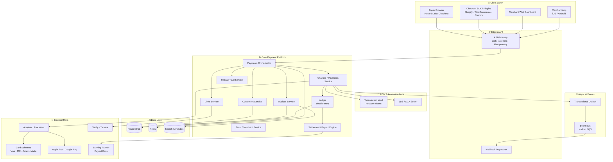
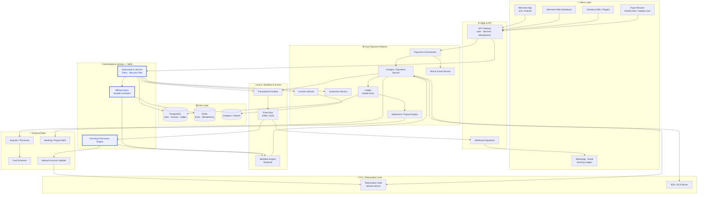
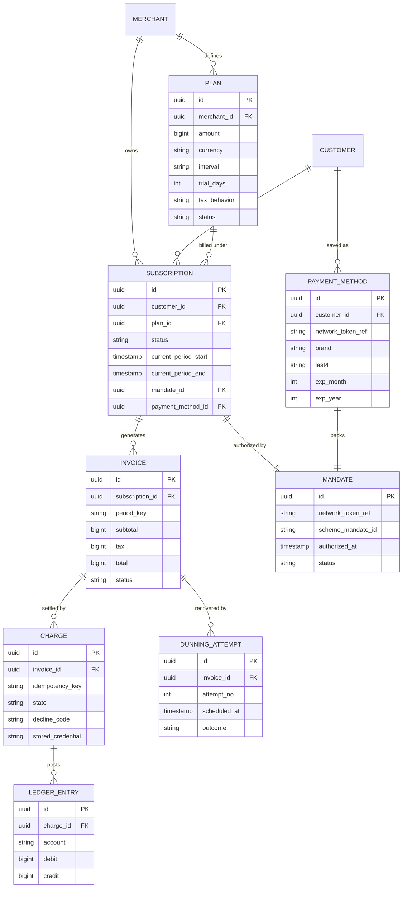
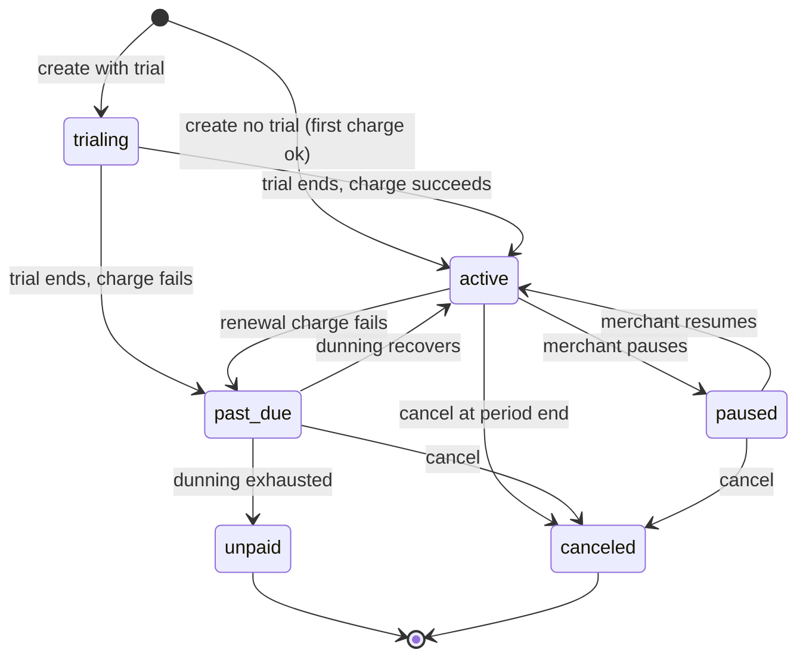
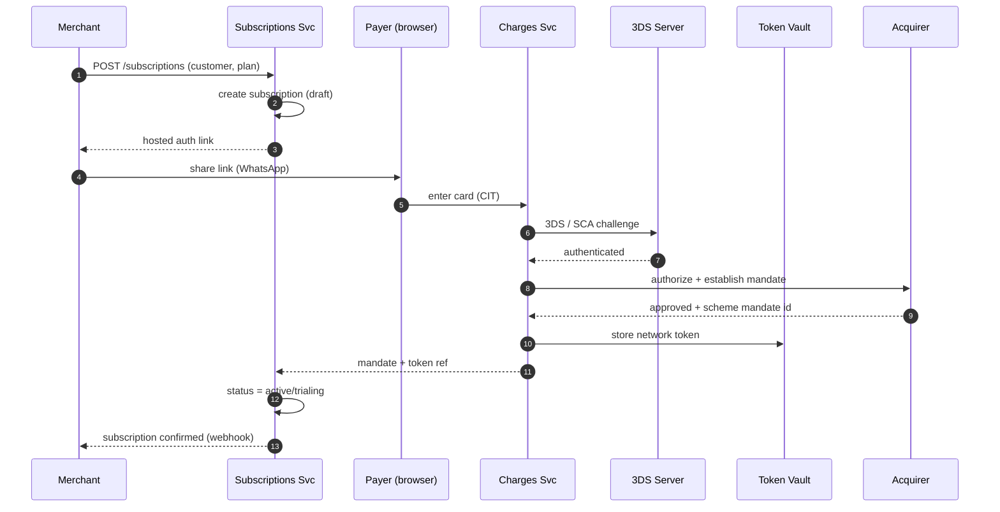
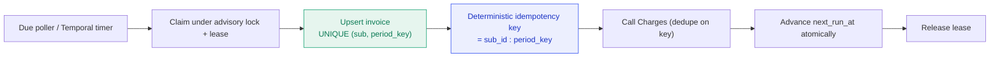
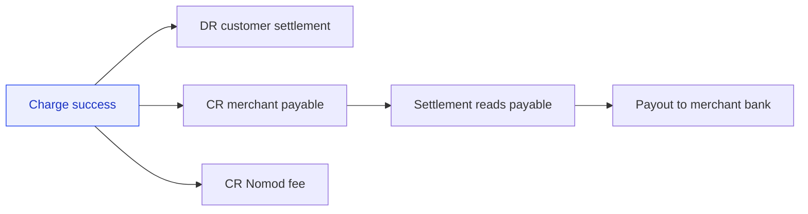
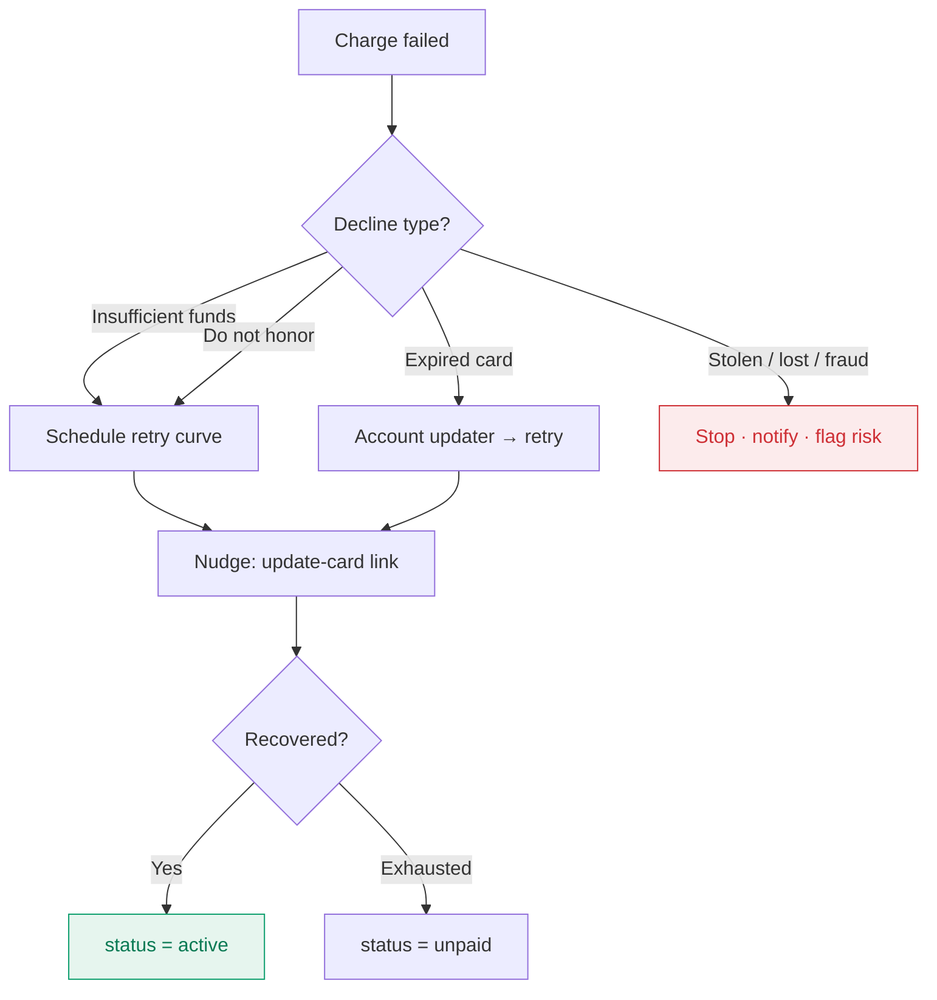
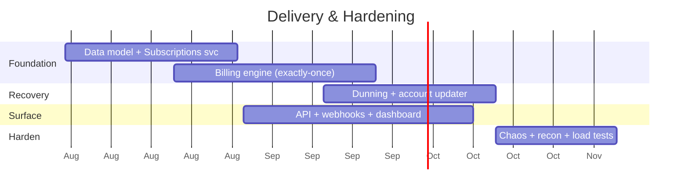

<div align="center">

# 🛠️ RFC — Nomod Subscriptions
### Technical Design: Recurring Billing with Smart Dunning


**How we build recurring billing that never double-charges, never misses a charge, and recovers failed payments automatically — inside Nomod's existing payment platform.**

</div>

---

| Field | Value |
|---|---|
| **RFC** | Nomod Subscriptions — Recurring Billing with Smart Dunning |
| **Version** | 1.0 (Proposed) |
| **Author** | Mohamed Shall |
| **Status** | 🟡 Proposed → Under Review |
| **Reviewers** | VP Engineering · Platform/Payments · Risk · SRE · Security |
| **Companion** | `PRD-Nomod-Subscriptions.md` |
| **Supersedes** | — |
| **Last updated** | 2026-07-27 |

> [!NOTE]
> This RFC assumes the product context defined in the PRD. It focuses on **architecture, data, flows, correctness guarantees, and trade-offs**. Diagrams render natively in GitHub / Mermaid-aware Markdown viewers.

---

## 📑 Table of Contents

1. [Summary](#-1-summary)
2. [Goals & Non-Goals (technical)](#-2-goals--non-goals-technical)
3. [Design Principles](#-3-design-principles)
4. [Current Nomod Architecture](#-4-current-nomod-architecture)
5. [Target Architecture — Where Subscriptions Fits](#-5-target-architecture--where-subscriptions-fits)
6. [Component Responsibilities](#-6-component-responsibilities)
7. [Data Model](#-7-data-model)
8. [Subscription Lifecycle State Machine](#-8-subscription-lifecycle-state-machine)
9. [Core Flows (Sequence Diagrams)](#-9-core-flows-sequence-diagrams)
10. [Billing Engine — Exactly-Once Design](#-10-billing-engine--exactly-once-design)
11. [Payments, Tokenization & 3DS](#-11-payments-tokenization--3ds)
12. [The Ledger (Double-Entry)](#-12-the-ledger-double-entry)
13. [Smart Dunning & Recovery Engine](#-13-smart-dunning--recovery-engine)
14. [Idempotency & Consistency Model](#-14-idempotency--consistency-model)
15. [Reliability & Failure Modes](#-15-reliability--failure-modes)
16. [API Design](#-16-api-design)
17. [Security & Compliance](#-17-security--compliance)
18. [Observability & SLOs](#-18-observability--slos)
19. [Scalability & Capacity](#-19-scalability--capacity)
20. [Tech Stack & Rationale](#-20-tech-stack--rationale)
21. [Alternatives Considered](#-21-alternatives-considered)
22. [Rollout & Migration](#-22-rollout--migration)
23. [Testing Strategy](#-23-testing-strategy)
24. [Open Questions & Risks](#-24-open-questions--risks)
25. [Appendix](#-25-appendix)

---

## 🎯 1. Summary

Nomod Subscriptions adds **recurring billing** and **smart dunning** as a new domain on top of Nomod's existing payment platform. It reuses the current `Customers`, `Invoices`, and `Charges` primitives and introduces three new components:

- **Subscriptions Service** — owns Plans, Subscriptions, and the lifecycle state machine.
- **Billing Engine** — a durable scheduler that generates invoices and triggers charges **exactly once** per period.
- **Dunning & Recovery Engine** — orchestrates retries, network account-updater refreshes, decline-code branching, and customer nudges.

The core engineering challenge is **money correctness under retries and partial failure**: never charge twice, never skip a period, keep a double-entry ledger as the single source of truth, and stay within PCI/scheme/CBUAE rules. This RFC specifies exactly how.

---

## 🎯 2. Goals & Non-Goals (technical)

**Goals**
- Deterministic, **exactly-once** billing per subscription period.
- **Idempotent** money movement, safe under retries and restarts.
- Minimal **PCI scope** — network tokens only, PANs never in our services.
- Correct **stored-credential mandate** handling (CIT + SCA, MIT renewals).
- Durable scheduling that survives deploys and outages.
- Clean extension of the **existing REST API** and event model.

**Non-Goals**
- Metered/usage billing engine (v2).
- Complex proration math (v2).
- Re-architecting existing acceptance flows (Links/Tap/Checkout unchanged).

---

## 🧭 3. Design Principles

| # | Principle | Consequence |
|---|---|---|
| P1 | **Correctness > latency** | Billing may be async and slower; it must never be wrong. |
| P2 | **The ledger is the source of truth** | Services never mutate balances directly; they post double-entry. |
| P3 | **Idempotency everywhere money moves** | Every charge carries a deterministic key; dedupe server-side. |
| P4 | **Tokenize, isolate PCI** | PANs live only in the vault; everything else uses token refs. |
| P5 | **Durable by default** | Use a workflow engine / outbox; no in-memory scheduling of money. |
| P6 | **Fail visibly, degrade gracefully** | DLQs, circuit breakers, alerts; never silent money loss. |
| P7 | **Reuse, don't rebuild** | Compose existing Charges/Invoices/Customers; add orchestration. |

---

## 🏛️ 4. Current Nomod Architecture

Nomod today is a mobile-first payment platform: merchants accept money via **Payment Links, Tap to Pay, Invoices, and Hosted Checkout / Gateway** (Shopify, WooCommerce, custom). Its public REST API already exposes `Links`, `Invoices`, `Charges`, `Hosted Checkout`, `Customers`, `Team`, and `Lookup Data`, which tells us the platform is built around **resources + webhooks**. Money settles to merchant accounts with T+2 / weekly / same-day (Membership) payouts.

### 4.1 Current-state system diagram



### 4.2 The money path today (one-off payment)

```
Payer → Gateway → Orchestrator → Charge → [Tokenize + 3DS] → Acquirer → Scheme
      → Ledger (double-entry) → Settlement/Payout → Merchant bank
      → Outbox → Event Bus → Webhook to merchant
```

> [!TIP]
> The key insight: Nomod already has the **hard parts** — tokenization, a charge service, a ledger, settlement, and an event/webhook backbone. Subscriptions is fundamentally an **orchestration layer** that decides _when_ to call the existing charge path and _what to do on failure_.

---

## 🚀 5. Target Architecture — Where Subscriptions Fits

We add a **Subscriptions Domain** (three new services, highlighted in blue) plus a **Durable Workflow Engine** for scheduling and dunning. Nothing in the existing acceptance path changes; we compose it.

### 5.1 Target-state system diagram



### 5.2 What changed vs. current state

| Added | Purpose |
|---|---|
| 🔵 **Subscriptions Service** | Plan CRUD, subscription lifecycle FSM, mandate references |
| 🔵 **Billing Engine** | Durable, sharded scheduler → generates invoices, enqueues charges exactly once |
| 🔵 **Dunning & Recovery Engine** | Retry orchestration, account-updater, decline branching, nudges |
| **Workflow Engine (Temporal)** | Durable execution for billing + dunning that survives restarts |
| **Network Account Updater** | Refresh stale card tokens before retrying |
| **Hosted Auth / Update-Card page** | CIT + 3DS mandate capture; self-serve card update |

> [!IMPORTANT]
> The blue services **never touch card data** and **never mutate the ledger directly**. They orchestrate the existing Charge service (which owns tokens + acquirer) and post results through it. This keeps PCI scope and money-correctness centralized.

---

## 🧩 6. Component Responsibilities

| Component | Owns | Talks to | Does NOT do |
|---|---|---|---|
| **Subscriptions Service** | Plans, Subscriptions, lifecycle FSM, mandate refs | Invoices, Customers, Billing, Outbox | Never calls acquirer or stores PAN |
| **Billing Engine** | Schedule of due periods, invoice generation trigger, charge enqueue | Workflow engine, Charges, Redis (locks) | No retry policy logic (that's Dunning) |
| **Dunning Engine** | Retry curve, account-updater, decline branching, comms trigger | Workflow, Account Updater, Charges, Outbox | Never bypasses idempotency |
| **Charges Service** (existing) | Tokenized charge, 3DS, acquirer call, ledger posting | Vault, 3DS, Acquirer, Ledger | Doesn't know about subscriptions |
| **Invoices Service** (existing) | Invoice records, tax, line items | Subscriptions, Ledger | — |
| **Ledger** (existing) | Double-entry postings, balances | Charges, Settlement | Any non-double-entry mutation |
| **Workflow Engine** | Durable execution of billing + dunning workflows | All of the above | Business rules (delegates) |

---

## 🗃️ 7. Data Model

### 7.1 Entity-relationship diagram



### 7.2 Schema (illustrative DDL)

```sql
CREATE TABLE plan (
  id            UUID PRIMARY KEY,
  merchant_id   UUID NOT NULL,
  amount        BIGINT NOT NULL,          -- minor units, e.g. fils
  currency      CHAR(3) NOT NULL,
  interval      TEXT NOT NULL,            -- 'week' | 'month' | 'year'
  trial_days    INT DEFAULT 0,
  tax_behavior  TEXT DEFAULT 'exclusive', -- 'inclusive' | 'exclusive'
  status        TEXT DEFAULT 'active',
  created_at    TIMESTAMPTZ DEFAULT now()
);

CREATE TABLE subscription (
  id                   UUID PRIMARY KEY,
  merchant_id          UUID NOT NULL,
  customer_id          UUID NOT NULL,
  plan_id              UUID NOT NULL REFERENCES plan(id),
  status               TEXT NOT NULL,     -- FSM state
  current_period_start TIMESTAMPTZ,
  current_period_end   TIMESTAMPTZ,
  mandate_id           UUID,
  payment_method_id    UUID,
  created_at           TIMESTAMPTZ DEFAULT now()
);
CREATE INDEX ix_sub_merchant ON subscription (merchant_id);

CREATE TABLE invoice (
  id              UUID PRIMARY KEY,
  subscription_id UUID NOT NULL REFERENCES subscription(id),
  period_key      TEXT NOT NULL,          -- e.g. 'sub_51:2026-08'
  subtotal        BIGINT NOT NULL,
  tax             BIGINT NOT NULL,
  total           BIGINT NOT NULL,
  status          TEXT NOT NULL,          -- 'open'|'paid'|'failed'|'void'
  UNIQUE (subscription_id, period_key)    -- exactly one invoice per period
);

CREATE TABLE charge (
  id               UUID PRIMARY KEY,
  invoice_id       UUID NOT NULL REFERENCES invoice(id),
  idempotency_key  TEXT NOT NULL UNIQUE,  -- dedupe guarantee
  state            TEXT NOT NULL,
  decline_code     TEXT,
  stored_credential TEXT,                 -- 'merchant_initiated'
  created_at       TIMESTAMPTZ DEFAULT now()
);

-- billing schedule: what to bill next, sharded for smoothing
CREATE TABLE billing_schedule (
  subscription_id UUID PRIMARY KEY REFERENCES subscription(id),
  next_run_at     TIMESTAMPTZ NOT NULL,
  shard           SMALLINT NOT NULL,      -- smears month-start spikes
  locked_by       TEXT,                   -- worker lease
  locked_until    TIMESTAMPTZ
);
CREATE INDEX ix_sched_due ON billing_schedule (next_run_at, shard);
```

### 7.3 Key invariants

- 🔒 `invoice UNIQUE(subscription_id, period_key)` → **at most one invoice per period**.
- 🔒 `charge UNIQUE(idempotency_key)` → **at most one charge per (subscription, period)**.
- 🔒 Ledger entries per charge must **sum to zero** (debits = credits).
- 🔒 A subscription state transition is only valid per the FSM (Section 8).

---

## 🔀 8. Subscription Lifecycle State Machine



| State | Meaning | Billable? |
|---|---|---|
| `trialing` | Free trial before first charge | No |
| `active` | Healthy, billing on schedule | Yes |
| `past_due` | A charge failed; dunning in progress | Retry only |
| `paused` | Merchant paused billing | No |
| `unpaid` | Dunning exhausted; access suspended | No |
| `canceled` | Ended | No |

---

## 🔄 9. Core Flows (Sequence Diagrams)

### 9.1 Subscribe — CIT with 3DS mandate



### 9.2 Recurring charge — MIT, exactly once

```mermaid
sequenceDiagram
    autonumber
    participant WF as Workflow Engine
    participant BILL as Billing Engine
    participant INV as Invoices Svc
    participant CHG as Charges Svc
    participant ACQ as Acquirer
    participant LED as Ledger
    participant OUT as Outbox/Events

    WF->>BILL: period due (subscription_id)
    BILL->>BILL: acquire advisory lock + lease
    BILL->>INV: create invoice (UNIQUE period_key)
    INV-->>BILL: invoice_id (or existing)
    BILL->>CHG: charge (Idempotency-Key = sub:period, MIT)
    CHG->>ACQ: authorize stored credential
    ACQ-->>CHG: approved
    CHG->>LED: post double-entry
    CHG->>OUT: emit invoice.paid
    CHG-->>BILL: success
    BILL->>BILL: advance next_run_at; release lock
```

### 9.3 Failed payment → smart dunning

```mermaid
sequenceDiagram
    autonumber
    participant CHG as Charges Svc
    participant OUT as Events
    participant DUN as Dunning Engine
    participant WF as Workflow Engine
    participant AU as Account Updater
    participant COMMS as WhatsApp/Email

    CHG->>OUT: invoice.payment_failed (decline_code)
    OUT->>DUN: consume event
    DUN->>DUN: classify soft vs hard decline
    alt hard decline (stolen/lost)
        DUN->>COMMS: notify; stop retries
        DUN->>DUN: mark for cancel/unpaid
    else soft decline
        DUN->>WF: schedule retry curve (d1,d3,d5,d7)
        WF->>AU: refresh token (account updater)
        AU-->>WF: updated token (maybe)
        WF->>CHG: retry charge (same idempotency discipline)
        alt recovered
            CHG-->>DUN: success → status active
        else exhausted
            DUN->>COMMS: final notice + update-card link
            DUN->>DUN: status = unpaid
        end
    end
```

---

## ⏱️ 10. Billing Engine — Exactly-Once Design

The hardest guarantee: **each period bills exactly once**, even across worker crashes, deploys, retries, and duplicate timers.

### 10.1 Mechanism



Three independent guards make double-charging impossible:

1. **Unique invoice per period** — `UNIQUE(subscription_id, period_key)`. A second attempt to create the same period's invoice is a no-op/returns existing.
2. **Deterministic idempotency key** — `sub_id:period_key`. The Charges service dedupes; a retried workflow step returns the original charge result, never a new charge.
3. **Advisory lock + lease** — only one worker processes a given subscription's due period at a time; leases expire so a crashed worker's item is safely re-claimed.

> [!CAUTION]
> **Never schedule money in memory.** In-process cron or `setTimeout` loses state on deploy and can double-fire. Use a **durable workflow** (Temporal) or a **transactional due-poller** backed by the DB. Durability is non-negotiable for billing.

### 10.2 Schedule smoothing (avoid the month-start thundering herd)

Many merchants bill on the 1st. Naively, that's a spike. We **shard** subscriptions across a `shard` column and process shards on a smeared timeline through the billing window, respecting the merchant's anchor date but distributing execution to protect the acquirer and our own throughput.

---

## 💳 11. Payments, Tokenization & 3DS

| Concern | Design |
|---|---|
| **Card storage** | Never store PANs. Store scheme **network tokens** in the vault; services hold only token refs. |
| **PCI scope** | Confined to the tokenization enclave + 3DS server; the Subscriptions domain is out of scope. |
| **First charge (CIT)** | Customer-initiated with **SCA/3DS** to authenticate and establish the recurring **mandate**. |
| **Renewals (MIT)** | Merchant-initiated with the correct **stored-credential indicator** + scheme mandate id; 3DS generally not re-prompted (exemption), per scheme rules. |
| **Account updater** | Before retries (and optionally pre-renewal), refresh tokens for updated/expired cards. |
| **Decline codes** | Branch: soft (retry) vs hard (stop). Map acquirer codes to a normalized taxonomy. |

> [!IMPORTANT]
> The **mandate** is the legal+technical backbone of recurring. Without a properly authenticated CIT and stored-credential MIT chain, renewals can be declined or disputed and violate scheme rules and CBUAE consumer-protection expectations.

---

## 📒 12. The Ledger (Double-Entry)

Every successful charge posts balanced, immutable double-entry lines. The ledger — not any service's local state — is the source of truth for money.

**Example: a successful AED 149.00 recurring charge (MDR 2.5% + AED 0.80 fee)**

| Account | Debit | Credit |
|---|---:|---:|
| Customer settlement (cash in) | 149.00 | |
| Merchant payable | | 145.08 |
| Nomod fee revenue | | 3.92 |

- Entries per charge **sum to zero**.
- Refunds, chargebacks, and payouts post their own balanced entries referencing the original.
- Settlement/payout reads merchant payable balance; it never mutates it out-of-band.



---

## 🔁 13. Smart Dunning & Recovery Engine

The revenue-recovery brain. Its job: turn failed charges back into paid charges with minimal merchant effort and controlled dispute risk.

### 13.1 Strategy

| Lever | Behavior |
|---|---|
| **Retry curve** | Configurable schedule (default d1, d3, d5, d7) with **jitter**; avoid low-approval windows. |
| **Account updater** | Refresh token before each retry — recovers expired-card failures silently. |
| **Decline branching** | Soft → retry; hard → stop + notify (never hammer a stolen-card decline). |
| **Customer nudge** | Hosted **"update your card"** link pushed via **WhatsApp**/email — meet merchants where they sell. |
| **Stop rules** | Cap attempts; honor opt-out; frequency-limit comms; move to `unpaid` on exhaustion. |
| **Ops guardrails** | Global dispute-rate monitor can throttle retry aggressiveness platform-wide. |

### 13.2 Decline handling



---

## 🧮 14. Idempotency & Consistency Model

| Guarantee | How |
|---|---|
| **Exactly-once billing** | Unique invoice per period + deterministic idempotency key + advisory lock |
| **Idempotent charges** | `charge.idempotency_key UNIQUE`; retried call returns original result |
| **Reliable events** | **Transactional outbox** — write event + state change in one DB tx; relay to bus |
| **At-least-once consumers** | Dunning/webhook consumers are **idempotent** (dedupe by event id) |
| **No dual-write** | Never write DB + bus separately; always DB-then-outbox |
| **Ledger consistency** | Strong consistency on ledger writes; read models eventually consistent |

**Consistency posture:** strong where money is decided (ledger, charge), eventual where it's merely reported (dashboards, analytics).

---

## 🛡️ 15. Reliability & Failure Modes

| Failure | Detection | Mitigation |
|---|---|---|
| Worker crash mid-charge | Lease timeout | Item re-claimed; idempotency prevents double-charge |
| Acquirer timeout (unknown result) | No response | Idempotent retry; reconcile via acquirer lookup before re-charging |
| Duplicate timer fires | — | Unique invoice + idempotency key → no-op |
| Event bus down | Outbox backlog grows | Outbox relay retries; alert on lag |
| Poison message | Repeated consumer failure | DLQ + alert + manual replay |
| Account updater unavailable | Error rate | Fall back to hosted update-card nudge |
| Month-start spike | Queue depth / latency | Shard smoothing + backpressure + circuit breaker to acquirer |
| Reconciliation drift | Ledger vs. acquirer mismatch | Daily recon job + alert; freeze payouts on unresolved drift |

> [!WARNING]
> The dangerous case is the **unknown acquirer result** (timeout after the request may have been processed). Rule: **look up before you retry** using the idempotency key / acquirer reference, so a retry can never create a second charge for a maybe-successful first attempt.

---

## 🔌 16. API Design

Extends the existing Nomod REST surface; consistent auth, idempotency header, error shape, and webhooks.

### 16.1 Endpoints

| Method | Path | Purpose |
|---|---|---|
| `POST` | `/v1/plans` | Create a plan |
| `GET` | `/v1/plans/{id}` | Retrieve a plan |
| `POST` | `/v1/subscriptions` | Create a subscription (returns hosted auth link) |
| `GET` | `/v1/subscriptions/{id}` | Retrieve subscription + status |
| `POST` | `/v1/subscriptions/{id}/pause` | Pause |
| `POST` | `/v1/subscriptions/{id}/resume` | Resume |
| `POST` | `/v1/subscriptions/{id}/cancel` | Cancel |
| `POST` | `/v1/subscriptions/{id}/payment-method` | Update saved card (hosted) |
| `GET` | `/v1/subscriptions/{id}/invoices` | List invoices |

### 16.2 Examples

```http
POST /v1/plans
Authorization: Bearer sk_live_***
Content-Type: application/json

{
  "amount": 14900,
  "currency": "AED",
  "interval": "month",
  "trial_days": 7,
  "tax_behavior": "inclusive"
}
```

```http
POST /v1/subscriptions
Idempotency-Key: sub-create-8f21c0
Authorization: Bearer sk_live_***

{
  "customer": "cus_8x2",
  "plan": "plan_gym_pro",
  "start_behavior": "3ds_mandate"
}
```

```json
// 201 Created
{
  "id": "sub_51",
  "status": "incomplete",
  "hosted_authorization_url": "https://pay.nomod.com/s/sub_51/auth",
  "current_period_end": null
}
```

```http
# Internal renewal (merchant-initiated), issued by the Billing Engine
POST /v1/charges
Idempotency-Key: sub_51:2026-08
{
  "invoice": "inv_9a2",
  "stored_credential": "merchant_initiated",
  "reason": "recurring"
}
```

### 16.3 Webhooks

```
subscription.created      invoice.created
subscription.activated    invoice.paid
subscription.past_due     invoice.payment_failed
subscription.recovered    dunning.attempt_made
subscription.canceled     dunning.exhausted
subscription.unpaid       card.updated
```

**Standards:** signed payloads (HMAC), at-least-once delivery, ret/backoff with DLQ, consumer idempotency via `event.id`, and versioned event schemas.

### 16.4 Errors & rate limits

- Consistent error envelope: `{ "error": { "type", "code", "message", "doc_url" } }`.
- Idempotency required on all money-moving `POST`s.
- Per-key rate limits; billing traffic uses internal, higher-limit lanes.

---

## 🔐 17. Security & Compliance

| Control | Implementation |
|---|---|
| **PCI-DSS** | Tokenization enclave only; PANs never in Subscriptions/Billing/Dunning |
| **Secrets** | KMS-backed secrets manager; short-lived credentials; least privilege |
| **Encryption** | TLS in transit; encryption at rest for all stores |
| **SCA / 3DS** | On CIT; MIT with stored-credential indicators per scheme |
| **Mandate audit** | Immutable record of consent (when, how, IP, auth result) |
| **CBUAE** | Consumer-protection: clear terms, easy cancel, failure notices |
| **AML/KYB** | Inherited from existing merchant onboarding; recurring adds no gap |
| **Tax/FTA** | FTA-compliant invoice fields; jurisdiction-abstracted for KSA ZATCA |
| **Data minimization** | Store only what's needed; PII access audited |

---

## 📈 18. Observability & SLOs

**Golden signals to instrument**

- Charge success rate & decline-code distribution (per market, per scheme).
- Dunning recovery rate & involuntary churn.
- Billing lag (scheduled vs. executed), workflow failures, DLQ depth.
- Reconciliation drift (ledger vs. acquirer).
- Dispute/chargeback rate (guardrail).

**Tracing:** every charge carries a trace id from schedule → invoice → charge → ledger → webhook.

**Example SLOs (illustrative)**

| SLO | Target |
|---|---|
| Billing executed within window of scheduled time | 99.9% |
| Zero double-charges | 100% (hard) |
| Dashboard read p95 | < 500 ms |
| Webhook delivered (at least once) within 1 min | 99.9% |

**Alerts:** dispute-rate nearing scheme threshold; reconciliation drift > 0; DLQ non-empty; billing lag breach.

---

## 📐 19. Scalability & Capacity

| Dimension | Approach |
|---|---|
| **Partitioning** | Partition/shard hot tables by `merchant_id`. |
| **Schedule smoothing** | `shard` column smears month-start spikes across the window. |
| **Async isolation** | Billing/dunning run off the interactive path; never block the API. |
| **Backpressure** | Bounded queues + circuit breakers to the acquirer. |
| **Horizontal scale** | Stateless workers behind the workflow engine; scale by shard count. |
| **Hot/cold data** | Recent invoices hot in PG; archive historicals; analytics in a separate store. |

---

## 🧰 20. Tech Stack & Rationale

| Layer | Choice | Why |
|---|---|---|
| Services / API | **TypeScript + NestJS** (Go for hot billing path if needed) | Matches a modern Node backend; strong typing; Go for throughput on the charge loop |
| Transactional store | **PostgreSQL** | ACID for ledger/subscriptions; unique constraints enforce invariants |
| Cache / coordination | **Redis** | Advisory locks, idempotency cache, rate limits |
| Workflow / scheduling | **Temporal** | Durable execution for billing + dunning that survives restarts |
| Eventing | **Kafka / SQS** | Decoupled, replayable events; DLQ support |
| Delivery reliability | **Transactional outbox** | No dual-write; exactly-once-ish downstream |
| Payments | **Network tokens + processor vault + 3DS server** | Minimal PCI scope; scheme-compliant recurring |
| Comms | **WhatsApp Business API + email** | Meets merchants/customers where they are |
| Observability | **OpenTelemetry + Prometheus/Grafana** | End-to-end tracing + golden signals |
| Infra | **Cloud + containers + IaC + feature flags** | Safe, incremental, reversible rollout |

---

## 🔄 21. Alternatives Considered

| Option | Pros | Cons | Decision |
|---|---|---|---|
| **Use processor's native billing** (e.g., Stripe Billing) | Fast to ship; offloads dunning | Cedes the ledger, data, and margin; weakens the moat; less control | ❌ Rejected — data + margin are strategic |
| **In-memory cron for scheduling** | Trivial to build | Loses state on deploy; risk of double/missed charges | ❌ Rejected — unsafe for money |
| **DB due-poller instead of Temporal** | Fewer moving parts | Reinventing durable execution; harder retries/visibility | 🟡 Viable fallback; Temporal preferred |
| **Build in-house (chosen)** | Owns ledger, dunning IQ, merchant data; feeds Capital/Compliance | More engineering | ✅ **Chosen** |
| **Event-sourced subscription core** | Perfect audit; time-travel | Complexity overkill for v1 | 🟡 Revisit at scale |

> [!NOTE]
> **Build-vs-buy is the headline trade-off.** We own the moat (ledger, dunning intelligence, merchant data) and thin-wrap commodity rails. This is what turns Subscriptions into the data foundation for Nomod Capital and the Compliance OS.

---

## 🚦 22. Rollout & Migration

- **No migration of existing data** — Subscriptions is additive; acceptance flows are untouched.
- **Feature-flagged** by merchant segment.
- **Phases:** internal alpha → 5–10 design partners → flagged GA → full GA.
- **Guardrail gates:** zero double-charges, dispute rate within thresholds, recovery ≥ target before each expansion.
- **Reversibility:** flags allow instant disable; workflows drain cleanly.



---

## 🧪 23. Testing Strategy

| Layer | Focus |
|---|---|
| **Unit** | FSM transitions, decline classification, idempotency-key derivation, tax math |
| **Integration** | Invoice uniqueness, charge dedupe, ledger balancing (sum-to-zero) |
| **Contract** | API + webhook schemas; processor MIT/CIT behavior |
| **Idempotency/chaos** | Kill workers mid-charge; duplicate timers; acquirer timeouts → assert no double-charge |
| **Load** | Month-start spike simulation with shard smoothing |
| **Reconciliation** | Ledger vs. acquirer daily; injected drift is detected + alerted |
| **Compliance** | 3DS/mandate flows; audit-trail completeness |

**Critical invariant test:** _under any interleaving of retries, crashes, and duplicate timers, each period yields exactly one invoice and at most one successful charge._

---

## ❓ 24. Open Questions & Risks

- [ ] Confirm processor support for **network tokens + account updater** in UAE and KSA.
- [ ] Temporal vs. DB due-poller — final call based on ops maturity.
- [ ] Grace-period policy defaults on `past_due` before suspension.
- [ ] Whether dunning-recovery is a **premium (Membership)** capability.
- [ ] Event schema versioning strategy for public webhooks.

**Top risks:** double-charge under partial failure (mitigated by triple-guard idempotency), dunning-driven disputes (mitigated by decline branching + guardrails), and acquirer-timeout ambiguity (mitigated by look-up-before-retry).

---

## 📎 25. Appendix

### 25.1 Idempotency key convention

```
charge idempotency key  = "{subscription_id}:{period_key}"
period_key              = "{YYYY}-{MM}"  (aligned to billing anchor)
example                 = "sub_51:2026-08"
```

### 25.2 Decline-code taxonomy (normalized)

| Class | Examples | Action |
|---|---|---|
| Soft | insufficient_funds, do_not_honor, temporary | Retry per curve |
| Expiry | expired_card | Account updater → retry |
| Hard | lost_card, stolen_card, fraud, revoked | Stop + notify + risk flag |

### 25.3 Glossary

See `PRD-Nomod-Subscriptions.md` §17.1 (CIT, MIT, SCA/3DS, network token, account updater, dunning, involuntary churn, MRR, TPV).

---

<div align="center">

**RFC — Nomod Subscriptions · v1.0 Proposed**
_Author: Mohamed Shall · Pair with `PRD-Nomod-Subscriptions.md`_

**Correctness > latency · The ledger is truth · Idempotency everywhere money moves**

</div>
